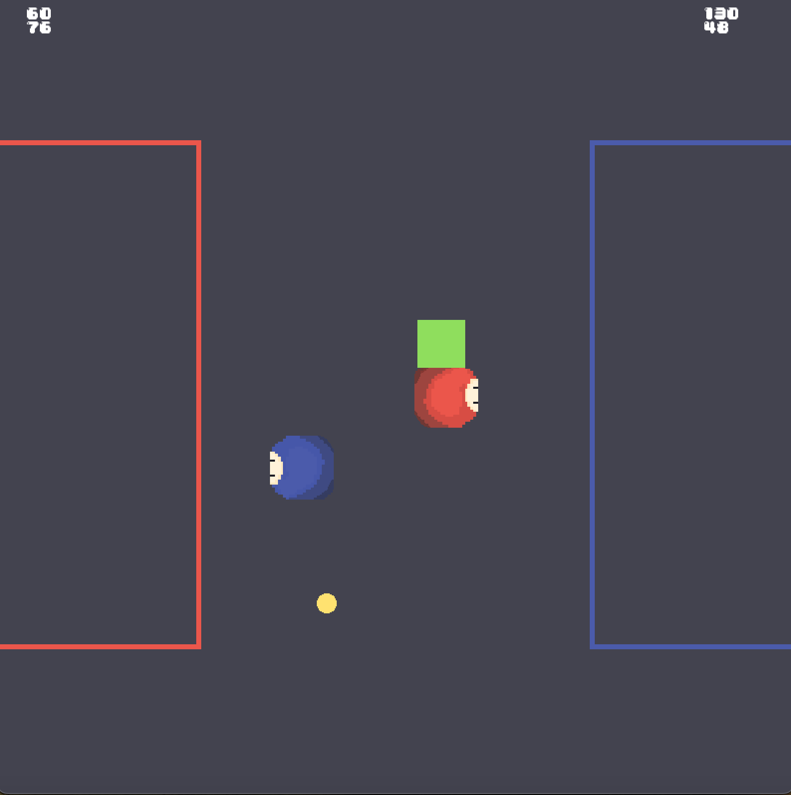

# Basic 2-Player Game built with SFML Library
In this game, 2 players try to get as many scores as possible by moving blocks in to their area until one reaches the target score.
This is a very simple game built with SFML library in C++ programming language. My major objectives of developing this game is to:
- Get used to OOP (object-oriented programming) and installing and using libraries in C++.
- How to link header files (.hpp files) and source code files (.cpp).
- Understand about the process of building a game and main component of a game.

